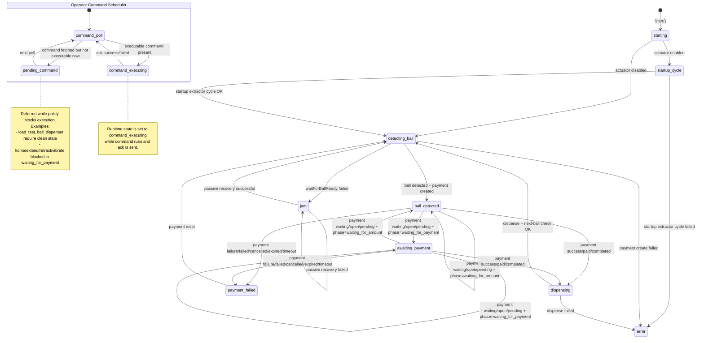

# Device State Machine

This diagram reflects the current runtime behavior implemented in `internal/device/client.go`.

## Command Policy Summary

- Always executable: `message`, `take_picture`, `cancel`
- Clean-state only: `load_test`, `ball_dispenser`
  - clean state means: no jam, no active payment, state is `detecting_ball` or `idle`
- Actuation commands: `home`, `extend`, `retract`, `vibrate`
  - allowed with active payment except when `payment_phase` is `waiting_for_payment`

## Data Signals Used

- Status endpoint: `GET /api/v1/payment/{id}`
- Transition signal for amount-selection phase split: `payment_phase`
  - `waiting_for_amount` keeps runtime in `ball_detected`
  - `waiting_for_payment` moves runtime to `awaiting_payment`
